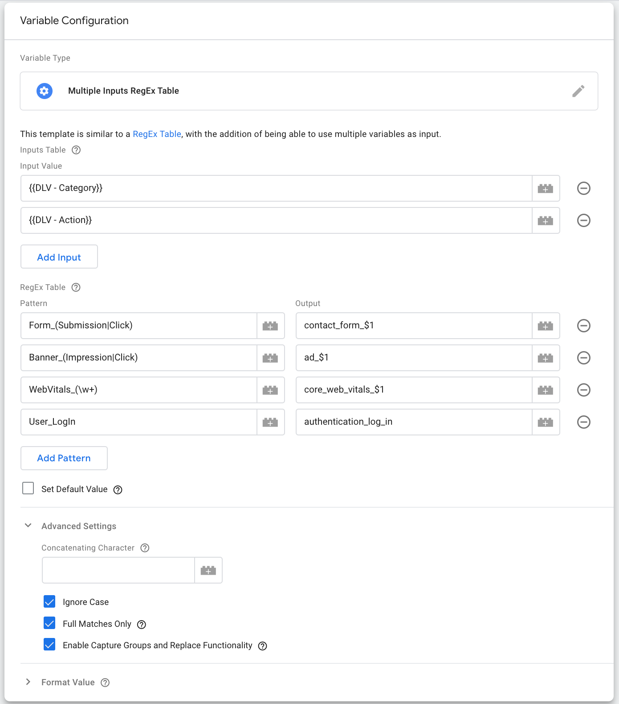

# Google Tag Manager 'Multiple Inputs RegEx Table' Variable Template

## Summary

This repository contains a [Google Tag Manager Variable template](https://developers.google.com/tag-manager/templates) similar to a [RegEx Table](https://j.st/4VwZ), with the addition of being able to use multiple variables as input. This is an excellent resource about how to use a [RegEx Table](https://www.simoahava.com/analytics/the-regex-table-variable-in-google-tag-manager/). You will be able to make use of the same functionality, with the addition ability of using multiple inputs.

## Usage
- Open a **Google Tag Manager** web container and click into the **Templates** from the left sidebar menu.
- In the **Variables Templates** section, click on **Search Gallery** button.
- Click on the Search Icon then type "multiple inputs".
- Select the **Multiple Inputs RegEx Table** template to your workspace.
- Use the new template as needed.

## Options

### Inputs Table
Add as many inputs as you need. Individual input values will be concatenated using "_" (which can be changed in *Advanced Settings*) to get a final input string. You can enter [Google Tag Manager variables](https://support.google.com/tagmanager/topic/7683268?hl=en&ref_topic=3441647) such as <strong>{{ My Object }}</strong>.

### RegEx Table
The concatenation of the *values* in the *Inputs Table* will be matched against each Pattern in the RegEx Table, from top to bottom. When a match is found, the Output value from that row will be returned. Enter Patterns using [Regular Expressions](https://support.google.com/tagmanager/answer/7679109?visit_id=637556570796808874-755449532&rd=1).

### Default Value
Explicitly set the value of this variable in case no match is made. Just like pattern outputs, this can be another Google Tag Manager variable.

### Advanced Settings

#### Concatenating Character
The character that will be used to concatenate the input values, defaults to "_". For example, if there are two input values inside the *Inputs Table*, the first one being `Foo` and the second one being `Bar`, the final input will be `Foo_Bar`.

#### Ignore Case
If enabled, the patterns are matched regardless of case, and the returned value will be in lowercase. This option is checked by default.

#### Full Matches Only 
If enabled, patterns must match entire input. This is equivalent to having start `(^)` and end `($)` anchors implicitly around your pattern. If disabled, patterns will match when they are found anywhere in the input. Disabling this option may cause unexpected behavior with the *"Capture Groups and Replace Functionality"*.  This option is checked by default.

#### Enable Capture Groups and Replace Functionality
If enabled, you can use [dollar-sign replacement syntax](https://262.ecma-international.org/5.1/#sec-15.5.4.11) to include portions of the input (e.g. from capturing groups in the matched pattern) within the output. Given the [limited support for regular expressions in Google Tag Manager templates](https://support.google.com/tagmanager/thread/49104943/google-tag-manager-custom-templates-and-regex-support?hl=en), only `$n` and `$&` are supported. Additionally, only the first 5 capture groups are available. 

Please note the following:  
- Using this option with <em>"Full Matches Only"</em> disabled may result in unexpected behavior (i.e. returning the entire input value with the matched portion replaced).  
- Using this option with <em>"Ignore Case"</em> enabled, the returned value from the group capture will be in lowercase.  

This option is checked by default.

## Examples

  

### Example 1
Let's assume the `{{ DLV - Category }}` equals **Form** and the `{{ DLV - Action }}` equals **Submission**.  
The RegEx table will match the **first pattern**, giving an output of `contact_form_submission` (all lowercase because of the Ignore Case option).

### Example 2
Let's assume the `{{ DLV - Category }}` equals **Banner** and the `{{ DLV - Action }}` equals **Click**.  
The RegEx table will match the **second pattern**, giving an output of `ad_click`.

### Example 3
Let's assume the `{{ DLV - Category }}` equals **WebVitals** and the `{{ DLV - Action }}` equals **CLS**.  
The RegEx table will match the **third pattern**, giving an output of `core_web_vitals_cls`.

### Example 4
Let's assume the `{{ DLV - Category }}` equals **User** and the `{{ DLV - Action }}` equals **LogIn**.  
The RegEx table will match the **fourth pattern**, giving an output of `authentication_log_in`.

## Contributing
See our [contributing guidelines](CONTRIBUTING.md).
